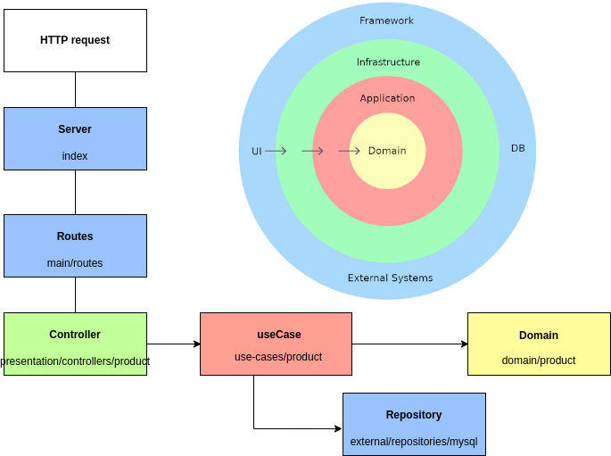

<h1 align="center">
   Product-API - Clean Architecture
</h1>

  <a href="#question-about">About</a>&nbsp;&nbsp;&nbsp;|&nbsp;&nbsp;&nbsp;
  <a href="#gear-technologies">Technologies</a>&nbsp;&nbsp;&nbsp;|&nbsp;&nbsp;&nbsp;
  <a href="#rocket-getting-started-with-docker">Getting Started</a>&nbsp;&nbsp;&nbsp;

# Project Overview:

  

---

  

## :question: About

Product-Api is a back-end application made with NodeJS.

I developed this app to apply the new things that I learned, like microservices and clean architecture.

## :gear: Technologies

**These are the technologies that I used to develop this application:**

⌨️ <strong>Typescript</strong> —> Extends JavaScript by adding types;  
⚙️ <strong>NodeJS</strong> —> A platform for building network applications; 
🌐 <strong>Express</strong> —> Web framework for Node.js 
⚙️ <strong>Serverless Framework</strong> —> The Easy & Open
Way To Build Serverless Apps; 
📚 <strong>Mysql</strong> —> Database 

 

## :rocket: Getting Started

1. Clone this repo: `git clone https://github.com/OtavioBernardes/product-clean-architecture-api`
2. Move to the directory: `cd product-clean-architecture`
3. Install all dependencies `npm install`
4. Run `npm run dev`
5. The server runs on: http://localhost:3333
